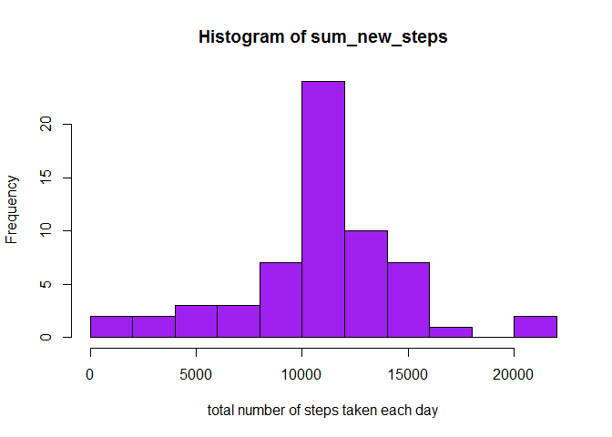

# Reproducible Research: Peer Assessment 1


## Loading and preprocessing the data

```r
data <- read.csv("activity.csv")
```
## What is mean total number of steps taken per day?


```r
sum_steps <- tapply(data$steps, data$date, sum, na.rm=TRUE)
hist(sum_steps,breaks = 10,col="red", xlab="total number of steps taken each day")
```

 

```r
mean(sum_steps, na.rm=TRUE)
```

```
## [1] 9354.23
```

```r
median(sum_steps, na.rm=TRUE)
```

```
## [1] 10395
```


## What is the average daily activity pattern?
1.Make a time series plot (i.e. type = "l") of the 5-minute interval (x-axis) and the average number of steps taken, averaged across all days (y-axis)

```r
mean_steps <- aggregate(x=list(steps=data$steps), by=list(interval=data$interval),mean, na.rm=TRUE)
plot(mean_steps, type="l", main = "Time Series Plot", xlab="5-minute Intervals", ylab="Avg Steps")
```

 

2.Which 5-minute interval, on average across all the days in the dataset, contains the maximum number of steps?

```r
mean_steps[which.max(mean_steps$steps),]
```

```
##     interval    steps
## 104      835 206.1698
```

## Imputing missing values
There are many days/intervals where there are missing values (coded as NA). The presence of missing days may introduce bias into some calculations or summaries of the data.

1.Calculate and report the total number of missing values in the dataset (i.e. the total number of rows with NA)

```r
sum_nas <- is.na(data$steps)
summary(sum_nas)
```

```
##    Mode   FALSE    TRUE    NA's 
## logical   15264    2304       0
```
2.Devise a strategy for filling in all of the missing values in the dataset. The strategy does not need to be sophisticated. For example, you could use the mean/median for that day, or the mean for that 5-minute interval, etc.

3.Create a new dataset that is equal to the original dataset but with the missing data filled in.


```r
replace_func <- function(steps, interval) {
    data_na <- NA
    if (!is.na(steps))
        data_na <- steps
    else
        data_na <- (mean_steps[mean_steps$interval==interval,"steps"])
    return(data_na)
}
new_data <- data
new_data$steps <- mapply(replace_func, new_data$steps, new_data$interval)
```

4.Make a histogram of the total number of steps taken each day and Calculate and report the mean and median total number of steps taken per day. Do these values differ from the estimates from the first part of the assignment? What is the impact of imputing missing data on the estimates of the total daily number of steps?


```r
sum_new_steps <- tapply(new_data$steps, new_data$date, sum, na.rm=TRUE)
hist(sum_new_steps,breaks = 10,col="purple", xlab="total number of steps taken each day")
```

 

```r
mean(sum_new_steps, na.rm=TRUE)
```

```
## [1] 10766.19
```

```r
median(sum_new_steps, na.rm=TRUE)
```

```
## [1] 10766.19
```

Mean and median values are higher than original data after filling missing data. because in the orginial data there are some days have steps equal to NA and total number of steps are equal to 0s by default.

## Are there differences in activity patterns between weekdays and weekends?

```r
data_weeks <- function(date)
        {
        if (weekdays(date)  %in% c("Monday", "Tuesday", "Wednesday", "Thursday", "Friday"))
                return("weekday")
        else if (weekdays(date) %in% c("Saturday", "Sunday"))
                return("weekend")
        
        }

data_with_weeks <- sapply(as.Date(new_data$date),data_weeks)
```

2.Make a panel plot containing a time series plot (i.e. type = "l") of the 5-minute interval (x-axis) and the average number of steps taken, averaged across all weekday days or weekend days (y-axis). See the README file in the GitHub repository to see an example of what this plot should look like using simulated data.


```r
library(ggplot2)
```

```
## Warning: package 'ggplot2' was built under R version 3.1.3
```

```r
days <- weekdays(as.Date(new_data$date))

averages <- aggregate(steps ~ interval + data_with_weeks , data = new_data, mean)
ggplot(averages, aes(interval, steps)) + geom_line() + facet_grid(data_with_weeks ~ .) +xlab("5-minute interval") + ylab("Number of steps")
```

 

yes, there is difference between weekend and weekdays
